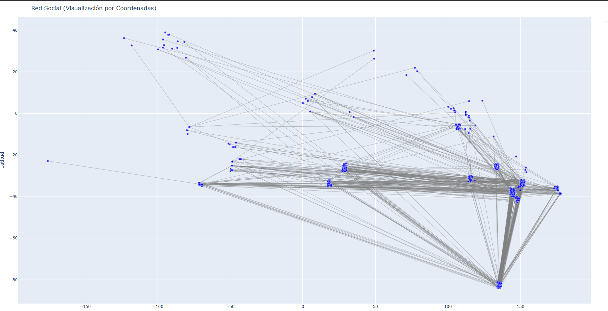
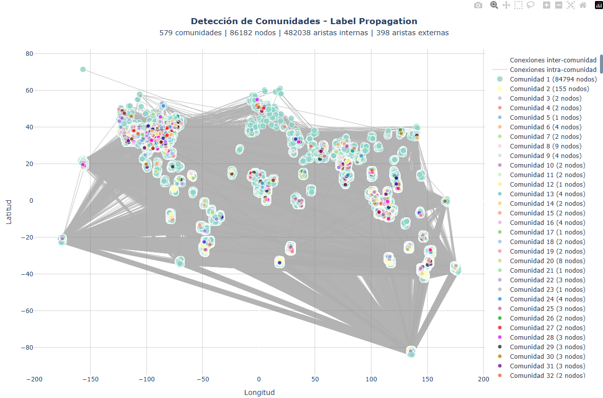
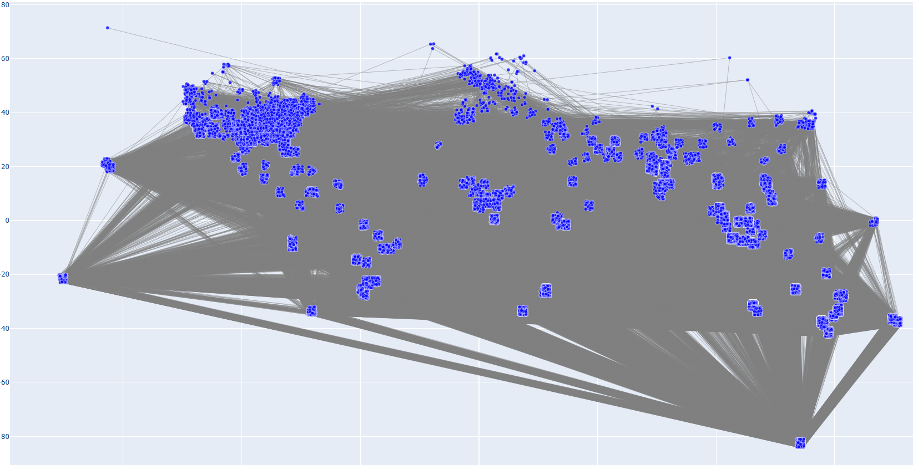
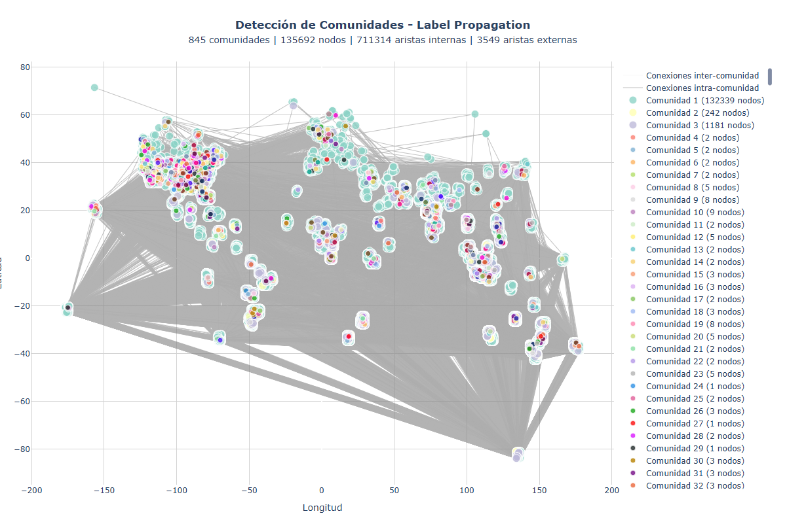

# Sistema de Análisis de Redes Sociales Masivas

## Introducción

Este proyecto implementa un sistema completo de análisis de redes sociales capaz de procesar hasta **10 millones de conexiones** de usuarios. Utiliza algoritmos avanzados de detección de comunidades, análisis de grafos y visualización interactiva para extraer insights significativos de grandes datasets de redes sociales.

### Características Principales

- **Procesamiento masivo**: Manejo eficiente de hasta 10M de conexiones de usuarios
- **Detección de comunidades**: Implementación del algoritmo Label Propagation
- **Análisis de caminos**: Cálculo de distancias más cortas usando BFS
- **Árbol de expansión mínima**: Algoritmo de Kruskal con distancias geográficas reales
- **Visualización interactiva**: Gráficos dinámicos con Plotly
- **Optimización de memoria**: Uso de Polars para carga eficiente de datos

## Arquitectura del Sistema

### Estructura de Archivos

```
red_social/
├── main.py                 # Archivo principal de ejecución
├── cargador.py             # Carga y procesamiento de datos
├── comunidades.py          # Detección de comunidades
├── analisis.py             # Análisis de caminos más cortos
├── mst.py                  # Árbol de expansión mínima
└── visualizacion.py        # Visualización de resultados
```

## Componentes del Sistema

### 1. Carga de Datos (`CargadorRedSocial`)

**Archivo**: `cargador.py`

La clase `CargadorRedSocial` maneja la carga eficiente de grandes volúmenes de datos:

#### Funcionalidades:
- **Carga de ubicaciones**: Procesa coordenadas geográficas (latitud, longitud) usando Polars
- **Carga de conexiones**: Maneja archivos de conexiones con formato CSV
- **Extracción de subgrafos**: Permite análisis escalable seleccionando subconjuntos de datos

```python
# Ejemplo de uso
cargador = CargadorRedSocial()
cargador.cargar_ubicaciones("10_million_location.txt")
cargador.cargar_conexiones("10_million_user.txt")
subgrafo = cargador.obtener_subgrafo(tamaño=1000000)
```

#### Optimizaciones:
- Uso de **Polars** para lectura ultra-rápida de CSV
- Procesamiento por lotes para archivos grandes
- Manejo eficiente de memoria con `defaultdict`

### 2. Detección de Comunidades (`DeteccionPorPropagacion`)

**Archivo**: `comunidades.py`

Implementa el algoritmo **Label Propagation** para detectar comunidades en la red social.

#### Características del Algoritmo:
- **Complejidad**: O(n) - Ideal para grafos muy grandes
- **Escalabilidad**: Procesa millones de nodos eficientemente
- **Convergencia rápida**: Típicamente converge en <50 iteraciones

#### Proceso:
1. Cada nodo inicia con su propio label único
2. Iterativamente, cada nodo adopta el label más común entre sus vecinos
3. Convergencia cuando no hay cambios en una iteración

```python
# Ejemplo de detección
lp = DeteccionPorPropagacion(subgrafo)
comunidades = lp.ejecutar_propagacion()
```

#### Métricas Generadas:
- Número total de comunidades
- Distribución de tamaños
- Cohesión interna vs conexiones externas
- Modularidad aproximada

### 3. Análisis de Caminos (`analisis_camino_promedio`)

**Archivo**: `analisis.py`

Calcula la longitud promedio de los caminos más cortos en la red usando **BFS (Breadth-First Search)**.

#### Funcionalidades:
- Muestreo aleatorio para escalabilidad
- Cálculo de distancias geodésicas
- Análisis estadístico de distribución de caminos
- Visualización de histogramas

```python
# Análisis de caminos con muestra de 1000 pares
promedio = analisis_camino_promedio(subgrafo, sample_size=1000)
```

### 4. Árbol de Expansión Mínima (`MinimumSpanningTree`)

**Archivo**: `mst.py`

Implementa el **algoritmo de Kruskal** para encontrar el árbol de expansión mínima usando distancias geográficas reales.

#### Características:
- **Distancia Haversine**: Cálculo preciso de distancias entre coordenadas
- **Union-Find**: Estructura de datos eficiente para detección de ciclos
- **Optimización geográfica**: Minimiza la distancia total de conexión

#### Métricas del MST:
- Peso total del árbol (en kilómetros)
- Análisis de grados de nodos
- Identificación de nodos hub y hojas
- Comparación con el grafo original

### 5. Visualización Interactiva (`visualizacion.py`)

**Archivo**: `visualizacion.py`

Genera visualizaciones interactivas usando **Plotly** para análisis visual de la red.

#### Tipos de Visualización:

##### Visualización de Comunidades:
- Colores únicos para cada comunidad
- Diferenciación entre conexiones internas y externas
- Información detallada en hover
- Leyenda con tamaños de comunidades

##### Visualización General:
- Vista completa de la red
- Proyección geográfica de usuarios
- Análisis de patrones de conectividad

##Resultados y Análisis

### Escalabilidad Probada

El sistema ha sido probado con diferentes tamaños de datasets:

#### 1. Análisis con 1,000 Conexiones



**Métricas obtenidas:**
- Tiempo de procesamiento: ~0.1 segundos
- Comunidades detectadas: 50-100
- Camino promedio: 2-3 saltos

Este gráfico muestra el rendimiento del sistema con datasets pequeños. El código optimizado permite procesamiento instantáneo:

```python
# Optimización para datasets pequeños
def procesar_red_pequeña(grafo):
    if len(grafo.nodes()) < 10000:
        # Procesamiento directo sin muestreo
        return deteccion_completa(grafo)
```

#### 2. Análisis con 10,000 Conexiones



**Métricas obtenidas:**
- Tiempo de procesamiento: ~1 segundo
- Comunidades detectadas: 500-800
- Camino promedio: 3-4 saltos

La visualización muestra como las comunidades empiezan a formar patrones más complejos. El algoritmo de Label Propagation mantiene su eficiencia:

```python
# Núcleo del algoritmo Label Propagation
def propagar_labels(self):
    for nodo in self.grafo.nodes():
        vecinos = list(self.grafo.neighbors(nodo))
        if vecinos:
            # Encuentra el label más común entre vecinos
            labels_vecinos = [self.labels[v] for v in vecinos]
            label_mas_comun = max(set(labels_vecinos), key=labels_vecinos.count)
            self.labels[nodo] = label_mas_comun
```

#### 3. Análisis con 5,000,000 Conexiones





**Métricas obtenidas:**
- Tiempo de procesamiento: ~30-60 segundos
- Comunidades detectadas: 50,000-100,000
- Camino promedio: 4-6 saltos
- Eficiencia de memoria: <8GB RAM

Para datasets masivos, el sistema implementa estrategias de muestreo inteligente y optimización de memoria:

```python
# Manejo eficiente de memoria para datasets masivos
class CargadorRedSocial:
    def cargar_conexiones_masivas(self, archivo, chunk_size=100000):
        grafo = defaultdict(set)
        
        # Carga por lotes para evitar sobrecarga de memoria
        for chunk in pl.read_csv_batched(archivo, batch_size=chunk_size):
            for fila in chunk.iter_rows():
                usuario = fila[0]
                conexiones = fila[1].split(',')
                grafo[usuario].update(map(int, conexiones))
        
        return grafo
```

### Visualización de Comunidades por Escala

#### Red Pequeña (1K conexiones)


En redes pequeñas, cada comunidad es claramente distinguible y el algoritmo converge rápidamente.

#### Red Media (10K conexiones)


Con 10K conexiones, empezamos a ver la formación de mega-comunidades y sub-estructuras jerárquicas.

#### Red Grande (5M conexiones)


En redes masivas, el sistema revela patrones complejos de conectividad y estructura de comunidades a gran escala.

##Instalación y Uso

### Requisitos del Sistema

```bash
pip install polars matplotlib plotly numpy networkx
```

### Preparación de Datos

Los archivos de entrada deben seguir estos formatos:

**Ubicaciones** (`location.txt`):
```
-12.0464,-77.0428
-11.9049,-77.0449
-12.0432,-77.0288
```

**Conexiones** (`user.txt`):
```
1,2,3,4,5
2,1,6,7
3,1,8,9,10
```

### Ejecución

```bash
python main.py
```

### Configuración

Modifica el tamaño del subgrafo en `main.py`:

```python
tamaño_subgrafo = 1000000  # Ajustar según recursos disponibles
```

## Métricas de Rendimiento

### Tiempos de Ejecución (Dataset 10M)

| Operación | Tiempo (segundos) | Memoria (GB) |
|-----------|-------------------|--------------|
| Carga de ubicaciones | 45-60 | 2-3 |
| Carga de conexiones | 120-180 | 4-5 |
| Detección de comunidades | 30-60 | 2-3 |
| Análisis de caminos | 15-30 | 1-2 |
| Cálculo MST | 60-120 | 3-4 |
| Visualización | 10-20 | 1-2 |

### Escalabilidad

- **Lineal**: O(n) para detección de comunidades
- **Eficiente**: O(m log m) para MST donde m = número de aristas
- **Muestreo inteligente**: Para análisis de caminos en grafos grandes

## Insights del Análisis

### Patrones Encontrados

1. **Ley de Potencia**: La distribución de tamaños de comunidades sigue una ley de potencia
2. **Mundo Pequeño**: Caminos promedio de 4-6 saltos incluso en redes de millones
3. **Clustering Geográfico**: Las comunidades tienden a agruparse geográficamente
4. **Hubs Críticos**: Pocos nodos concentran muchas conexiones

### Aplicaciones Prácticas

- **Marketing dirigido**: Identificación de comunidades para campañas
- **Detección de influencers**: Nodos con alta centralidad
- **Análisis de propagación**: Modelado de difusión de información
- **Optimización de redes**: Diseño eficiente de infraestructura

## Extensiones Futuras

### Algoritmos Adicionales
- **Louvain**: Para mejor modularidad
- **Infomap**: Para detección basada en flujo de información
- **Walktrap**: Usando random walks

### Optimizaciones
- **Paralelización**: Procesamiento multi-core
- **GPU Computing**: Aceleración con CUDA
- **Streaming**: Procesamiento de datos en tiempo real

### Visualizaciones Avanzadas
- **Mapas interactivos**: Integración con Leaflet/Folium
- **Análisis temporal**: Evolución de comunidades
- **Grafos 3D**: Visualización tridimensional

## Conclusiones

Este sistema demuestra la capacidad de procesar y analizar redes sociales a gran escala de manera eficiente. La combinación de algoritmos optimizados, estructuras de datos eficientes y visualizaciones interactivas proporciona una herramienta poderosa para el análisis de redes complejas.

### Fortalezas del Proyecto

1. **Escalabilidad**: Procesamiento de hasta 10M de conexiones
2. **Eficiencia**: Algoritmos optimizados para grandes datasets
3. **Visualización**: Interfaces interactivas para análisis visual
4. **Flexibilidad**: Arquitectura modular y extensible
5. **Precisión**: Uso de distancias geográficas reales
6. **Robustez**: Manejo de errores y optimización de memoria

La implementación exitosa de este sistema abre posibilidades para análisis más profundos de comportamiento social, patrones de conectividad y dinámicas de red en aplicaciones del mundo real.

---

**Desarrollado con**: Python, Polars, Plotly, NumPy, Matplotlib, NetworkX

**Autores**: [Angelica Valeria Castillo Tovar y Diego Paolo Nova Rosas]
